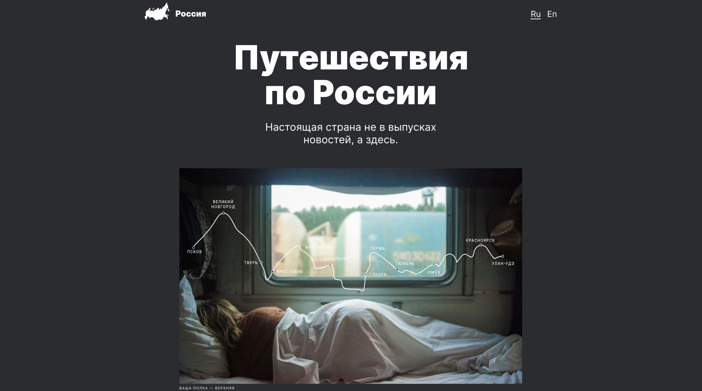

# Путешествие по России

### Описание
Проект посвящен адаптации сайта на различные разрешения с использованием @media запросов:
* 1280px;
* 1024px;
* 768px;
* 320px.

  ### Функционал:
* Адаптивный интерфейс для разных устройств.

### **Какие технологии использовались**
* HTML
*  CSS:
    - Flex layout;
    - Grid layout;
    - Позиционирование элементов;
    - Адаптация сайта с использованием @media запросов;
* Методология БЭМ;
* Файловая структура БЭМ Nested.
* Верстка Pixel Perfect;

### **Макет проекта в Figma**
[Макет](https://www.figma.com/file/5S2WSbEFL6awjVWJ0NWL8Q/Sprint-3_-Russia-_-desktop-%2B-mobile?type=design&node-id=28503-0&mode=design)

### **Ссылка на сайт**
https://ksenia-beznos.github.io/russian-travel/

**Автор сайта**: Ксения Безнос.
